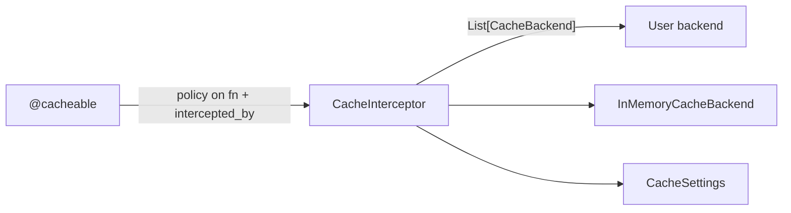

# Architecture

| Module | Responsibility |
|---|---|
| `decorators.py` | `@cacheable` marker |
| `interceptor.py` | get-or-compute; key + TTL resolution |
| `backend.py` | `CacheBackend` protocol + built-in LRU/TTL |
| `config.py` | `CacheSettings` |

## Design decisions

**Backend as a protocol, selection by presence.** Implement `CacheBackend`
as a `@component` and it replaces the built-in — no registry, no config key
naming a class. The rule (first non-builtin wins) lives in one constructor.

**Backends are sync by contract.** `get`/`set` are called from both sync and
async paths; a sync contract keeps backends trivial. An async-native backend
(e.g. Redis via asyncio) is a future extension, not a v0.1 constraint.

**The awaited result is cached, never the coroutine.** A cached coroutine
can be awaited once; caching it is always a bug. The interceptor branches on
`iscoroutinefunction` and stores only settled values.

**Repr-based default key.** Explicit, printable, debuggable. Arguments with
unstable reprs need `key=callable` — documented rather than hidden behind
hashing magic.

**Exceptions are not cached.** A failure is re-executed next call. Negative
caching is a policy decision the application should make explicitly.
